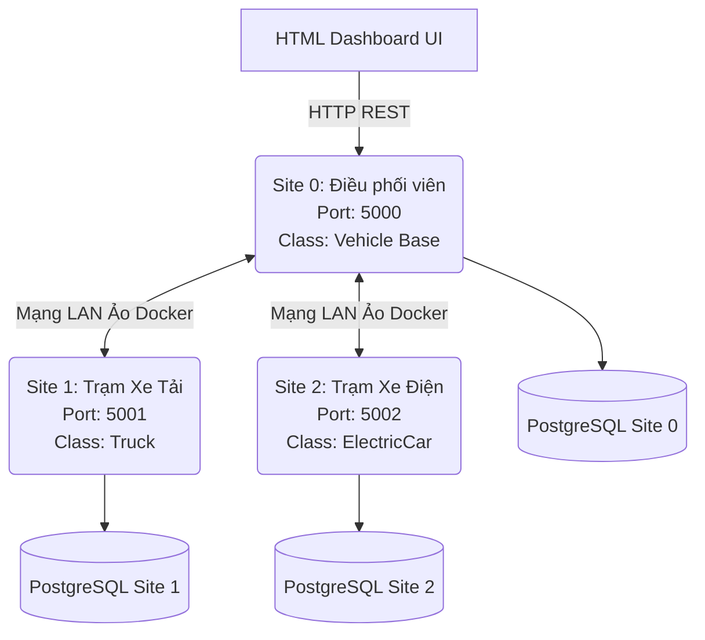

# Vehicle Fleet Distributed Database — Project #89

> **Môn học**: Hệ Quản Trị Cơ Sở Dữ Liệu Phân Tán (Distributed Database Systems)  
> **Chủ đề**: Xử lý tính kế thừa phân tán: "Đội xe" (Distributed Inheritance Handling: "Vehicle Fleet")  
> **Tài liệu tham khảo cốt lõi**: Özsu & Valduriez, *Principles of Distributed Database Systems* (4th Ed.)

---

## 📋 Tổng quan Dự án (Project Overview)

Dự án này là một phiên bản mô phỏng hoàn chỉnh của một **Hệ Quản trị Cơ sở dữ liệu Hướng đối tượng Phân tán (Distributed OODBMS)**. Dự án xử lý bài toán **Kế thừa Phân tán (Distributed Inheritance)** cho hệ thống quản lý phương tiện vận tải trải rộng trên 3 máy chủ (Site) hoàn toàn độc lập về mặt địa lý.

| Khái niệm (Concept) | Áp dụng trong hệ thống | Lý thuyết tham chiếu |
|---|---|---|
| **Định danh phân tán** | Cấp phát `OID` dạng `Site.Class.Seq`, chia sẻ qua các mảnh | Object Identity |
| **Kế thừa lớp** | Cây phân cấp `Vehicle → Truck`, `Vehicle → ElectricCar` | The Object Model |
| **Phân mảnh dọc** | Khung gầm lưu tại Site 0, đặc tả riêng lưu tại Site 1/2 | Vertical Fragmentation |
| **Tối ưu hóa băng thông** | Kỹ thuật **Bán kết nối (Semi-Join)** & Fetch song song đa luồng | Distributed Query Optimization |
| **Tiến hóa lược đồ** | Cập nhật cấu trúc JSON động (Eventual Consistency Schema Evolution) | Schema Evolution |
| **Chịu lỗi mạng** | Cơ chế **Fail-fast Timeout (1.0s)** bỏ qua các Site sập | Fault Tolerance & Availability |

---

## 🏗️ Kiến trúc Hệ thống (Architecture)

Mạng lưới được thiết lập theo chuẩn **Shared-Nothing** (Mỗi Node tự chạy một Web Server API và một Database PostgreSQL độc lập hoàn toàn).



*   **Coordinator (Điều phối viên):** Nằm tại Site 0. Nó gánh vác trách nhiệm lập kế hoạch phân giải truy vấn (Query Planner) và khâu nối các mảnh dữ liệu (Rehydration).
*   **Database:** Sử dụng PostgreSQL đảm bảo tính bền vững (Durability) của CSDL qua các lần tắt/bật.

---

## 🚀 Hướng dẫn Triển khai (Quick Start)

Dự án được "đóng gói" 100% bằng **Docker Compose**, giúp bạn chạy trơn tru trên mọi hệ điều hành mà không sợ xung đột môi trường.

### Bước 1: Khởi động mạng lưới phân tán
Bật Docker Desktop, mở Terminal tại thư mục gốc của dự án và chạy:
```bash
docker compose up -d --build
```
*(Chờ khoảng 15 giây để 3 CSDL PostgreSQL khởi tạo thành công).*

### Bước 2: Bơm dữ liệu thực tế (Seed Data)
Để hệ thống có dữ liệu chạy thử (từ kho dữ liệu xe điện và xe tải mã nguồn mở), bạn hãy bơm dữ liệu từ Script:
```bash
docker compose --profile seed run --rm seeder
```
*(Lưu ý: Nếu bạn muốn xóa trắng cơ sở dữ liệu để bơm lại từ đầu, hãy chạy lệnh `docker compose down -v` trước khi làm Bước 1).*

### Bước 3: Truy cập Bảng điều khiển (Dashboard)
Hệ thống đi kèm với một giao diện Web hiện đại, tích hợp ngay bên trong Điều phối viên.
👉 **Mở trình duyệt và truy cập:** [http://localhost:5000/](http://localhost:5000/)

---

## 💻 Trải nghiệm Giao diện Web (Dashboard Features)

Bảng điều khiển cho phép bạn tương tác trực quan với các lý thuyết phân tán phức tạp nhất:

1. **Query Planner Demo (Tìm kiếm Đa hình & Bán kết nối):**
   - Hỗ trợ lọc theo `Class`, `Field` linh hoạt qua bộ chọn thả xuống (Datalist).
   - Chọn `Class = Vehicle` để thấy thuật toán phát tín hiệu tới cả 3 Site và ráp nối (Rehydrate) thuộc tính.
   - Báo cáo **Network Timing** bên dưới cho biết thuật toán Tối ưu hóa Truy vấn đã chọn Driver Site nào để tiết kiệm băng thông mạng.

2. **Site Status (Trạng thái Node):**
   - Ping thời gian thực toàn bộ mạng lưới để lấy số lượng đối tượng (Objects) đang lưu tại mỗi máy chủ.

3. **Schema Evolution (Tiến hóa Lược đồ):**
   - Thêm cột mới (ví dụ: `mileage_km`, `insurance`) mà không cần chạy lệnh `ALTER TABLE`. 
   - Hỗ trợ nhập định dạng `string`, `number`, `boolean` và Broadcast đồng loạt cho mạng lưới. Cơ chế **Pending Queue** đảm bảo đồng bộ bù (Catch-up) cho các site đang tắt.

4. **Benchmark (Biểu đồ Sức chịu tải):**
   - Khởi động hàng loạt truy vấn đa luồng từ 10 đến 500 đối tượng. Tự động sinh biểu đồ `benchmark_results.png` đo đếm thời gian song song (Parallel Fetch) và thời gian khâu nối (Rehydration).

5. **Failure Demo (Kiểm thử Chịu lỗi):**
   - Tắt nóng một Site (Ví dụ: `docker compose stop site1`).
   - Lên giao diện Query, hệ thống áp dụng cơ chế **Fail-fast 1.0s**, chặn đứng kết nối lỗi và trả về dữ liệu an toàn từ các site còn sống (Availaibility over Consistency).

---

## 📁 Cấu trúc Thư mục (Project Structure)

```text
vehicle-fleet-distributed/
├── src/
│   ├── config.py          # Cấu hình mạng lưới, Phân mảnh, Timeout
│   ├── coordinator.py     # Lõi Điều phối viên: Query Planner, Semi-join, Schema Eventual Consistency
│   ├── models.py          # Khai báo Lược đồ Dataclass và thư viện ép kiểu Marshmallow
│   ├── oid_manager.py     # Cấp phát Object ID duy nhất toàn cục (SiteID.ClassName.Seq)
│   ├── site_server.py     # Flask API Server & Routing các Endpoints nội bộ
│   └── templates/
│       └── index.html     # Giao diện trực quan Dashboard UI
├── setup/
│   └── seed_data.py       # Script ETL tải và dọn dẹp dữ liệu thực tế từ GitHub
├── benchmark.py           # Script giả lập Stress-test để xuất biểu đồ
├── docker-compose.yml     # Quản lý vòng đời của 6 Containers (3 Web API + 3 PostgreSQL DB)
└── requirements.txt       # Các thư viện Python cần thiết
```

---

## 📚 Mốc Đánh Giá Sự Hoàn Thiện
Dự án đã giải quyết thành công các thách thức:
1. Giảm thiểu chi phí truyền tải qua mạng (Network Transmission Cost) bằng Semi-Join.
2. Triệt tiêu Single Point of Failure (SPOF) cho Dữ liệu bằng Shared-Nothing Architecture.
3. Vượt qua Rào cản Dữ liệu Lớn với kỹ thuật Parallel Fetch bằng `ThreadPoolExecutor`.
4. Không gián đoạn hệ thống (Zero-downtime) khi cập nhật lược đồ JSON lỏng lẻo.
